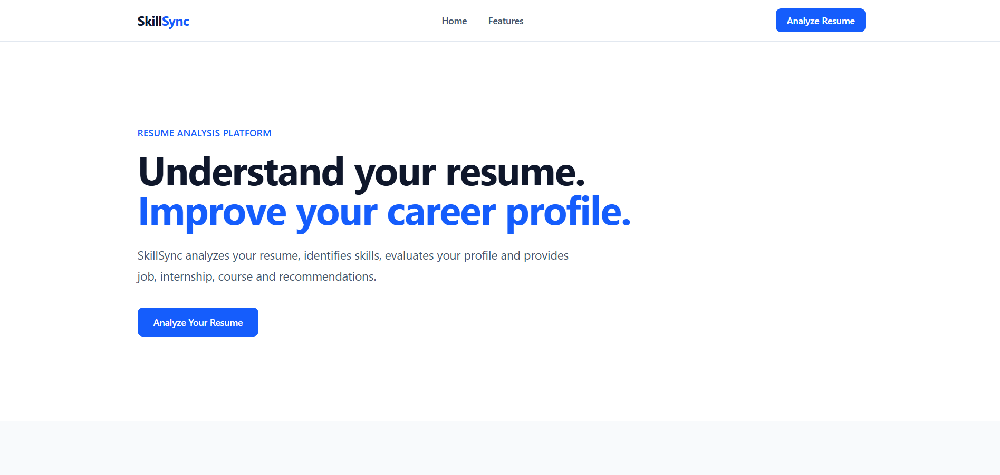
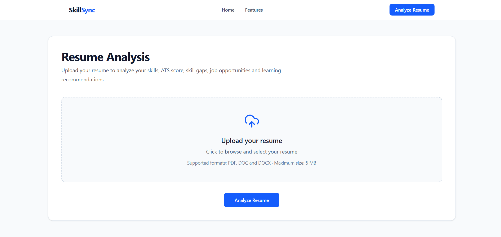
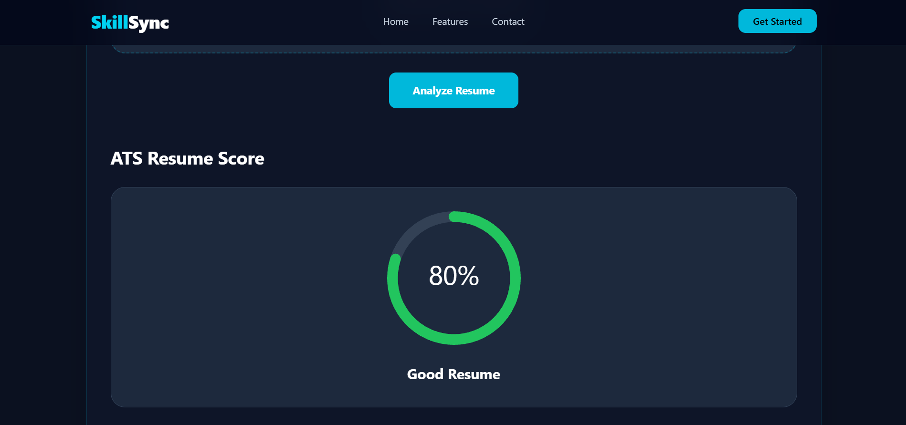
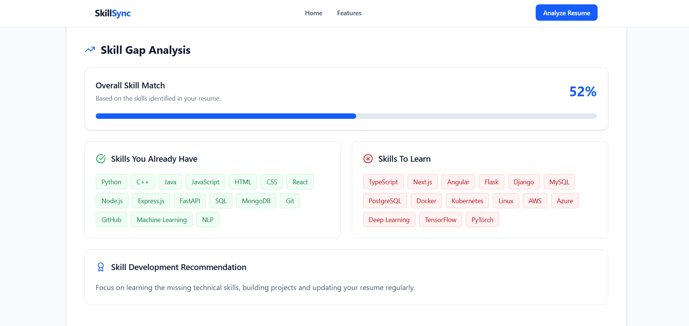
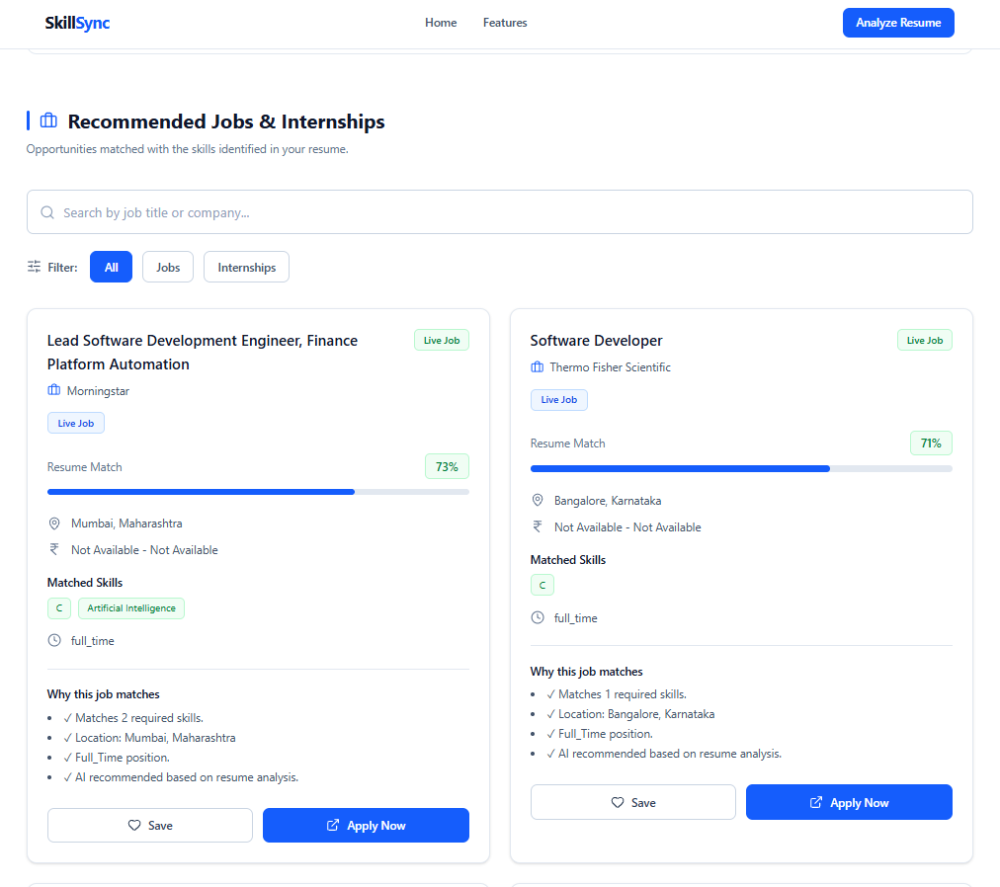
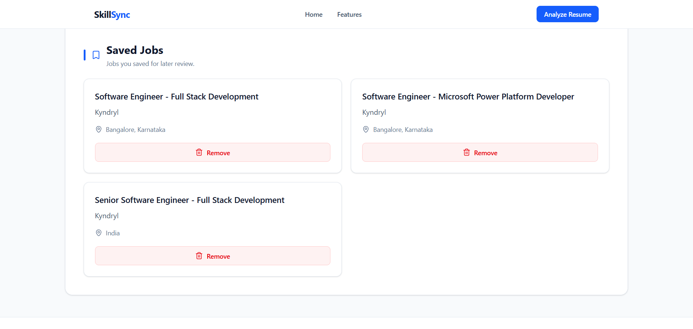
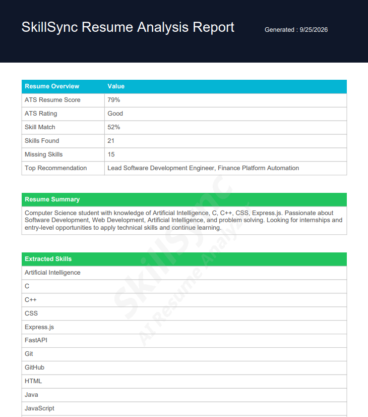

# SkillSync -- AI Resume Analyzer & Job Recommendation System

**SkillSync** is an AI-powered web application that analyzes resumes,
identifies skill gaps, evaluates ATS-oriented resume quality, recommends
learning resources and interview questions, and matches users with
relevant job and internship opportunities.

## ✨ Features

-   📄 PDF, DOC and DOCX resume upload
-   📊 ATS resume score and rating
-   🧠 Resume skill extraction
-   🎯 Skill gap analysis and skill match percentage
-   💡 AI-generated resume improvement suggestions
-   🎓 Course recommendations for missing skills
-   🎤 Personalized interview questions
-   💼 AI-based job and internship recommendations
-   🌐 Live job search using the Adzuna API
-   🔎 Search and filter recommendations
-   ❤️ Save and remove jobs using browser storage
-   📑 Professional PDF resume analysis report
-   💧 SkillSync watermark on generated reports

## 🛠 Tech Stack

### Frontend

-   React
-   JavaScript
-   Tailwind CSS
-   Axios
-   Lucide React
-   React Circular Progressbar
-   jsPDF
-   jsPDF-AutoTable
-   React Toastify

### Backend

-   Python
-   FastAPI
-   Uvicorn
-   PyPDF2
-   Requests
-   Python-dotenv

### AI / NLP

-   Natural Language Processing (NLP)
-   Skill extraction
-   Text similarity
-   TF-IDF / similarity-based matching
-   RapidFuzz-based text similarity where applicable

### Data

-   CSV-based job and internship datasets
-   Adzuna API for live job data

## 🏗️ System Flow

``` text
User
  ↓
React Frontend
  ↓
FastAPI Backend
  ↓
Resume Parser
  ↓
Skill Extraction + ATS Analysis
  ↓
Skill Gap + Resume Suggestions
  ↓
Job / Internship Recommendation Engine
  ├── CSV Dataset
  └── Adzuna Live Jobs API
  ↓
Results Dashboard
  ↓
PDF Report / Save Jobs
```

## 📂 Project Structure

``` text
SkillSync/
├── backend/
│   ├── app/
│   │   ├── routes/
│   │   ├── services/
│   │   ├── uploads/
│   │   └── ...
│   ├── requirements.txt
│   └── run.py
│
├── frontend/
│   ├── src/
│   │   ├── assets/
│   │   ├── components/
│   │   ├── pages/
│   │   ├── services/
│   │   └── ...
│   ├── package.json
│   └── ...
│
└── README.md
```

## ⚙️ Installation

### 1. Clone the repository

``` bash
git clone https://github.com/Umar95888/SkillSync-AI-Resume-Analyzer.git
cd SkillSync-AI-Resume-Analyzer
```

### 2. Backend

``` bash
cd backend
python -m venv venv
venv\Scripts\activate
pip install -r requirements.txt
```

Create `backend/.env`:

``` env
ADZUNA_APP_ID=your_adzuna_app_id
ADZUNA_APP_KEY=your_adzuna_app_key
```

Run the backend:

``` bash
python run.py
```

The API normally runs at:

``` text
https://skillsync-ai-resume-analyzer-ed3n.onrender.com
```

### 3. Frontend

Open another terminal:

``` bash
cd frontend
npm install
npm run dev
```

Open the local URL shown by Vite.

## 🔐 Environment Variables

Never commit API credentials to GitHub.

Add `.env` to `.gitignore`:

``` text
.env
```

## 🔄 How SkillSync Works

1.  User uploads a resume.
2.  Resume text is extracted.
3.  Technical skills are detected.
4.  ATS-oriented score is calculated.
5.  Missing skills are identified.
6.  Resume suggestions are generated.
7.  Courses and interview questions are recommended.
8.  Jobs and internships are matched against the resume.
9.  Live jobs are fetched when available.
10. Results are shown in the dashboard.
11. Users can save jobs or download a PDF report.

## 🧠 Recommendation Approach

The recommendation engine compares resume information with job
information using:

-   Resume text
-   Extracted skills
-   Job description
-   Required job skills
-   Matched skills
-   Missing skills
-   Text similarity

Opportunities are scored and ranked according to their estimated
relevance to the resume.

## 🌐 Live Job Search

SkillSync supports live job retrieval through the Adzuna Jobs API.

Live results can include:

-   Job title
-   Company
-   Location
-   Salary
-   Description
-   Application link
-   Category
-   Contract type
-   Contract time

If live retrieval is unavailable, the project can use its dataset-based
recommendation flow.

## 📑 PDF Report

The generated report contains:

-   ATS Resume Score
-   ATS Rating
-   Skill Match Percentage
-   Extracted Skills
-   Missing Skills
-   AI Resume Suggestions
-   Top Job Recommendations
-   SkillSync watermark

## 🎯 Objectives

-   Automate resume analysis.
-   Help users understand ATS-oriented resume quality.
-   Identify missing technical skills.
-   Recommend learning resources.
-   Generate personalized interview questions.
-   Recommend relevant jobs and internships.
-   Provide live job opportunities when available.
-   Generate an easy-to-read analysis report.

## 🚧 Limitations

-   ATS scoring is an estimation and is not an official score from a
    specific company's ATS.
-   Live job availability depends on the external API.
-   Recommendation quality depends on the available job data.
-   Resume parsing may be less accurate for complex or image-based
    resumes.
-   Results depend on the information provided by the resume and
    available data sources.

## 🔮 Future Enhancements

-   User authentication and profiles
-   Resume history
-   Database integration
-   Resume comparison
-   AI resume rewriting
-   AI career assistant
-   Personalized learning paths
-   Job alerts and notifications
-   Additional real-time job sources
-   Advanced analytics

## 👥 Team

**Project:** SkillSync -- AI Resume Analyzer & Job Recommendation System

-   Muhammad Umar
-   Divyansh Raj
-   Sarvesh Singh
-   Roshan Srivastava

**Department:** Computer Science and Engineering\
**College:** United Institute of Technology, Allahabad\
**Academic Session:** 2023--27


## 📸 Screenshots

### 🏠 Landing Page


### 📄 Resume Upload


### 📊 ATS Resume Analysis


### 🧠 Skill Gap Analysis


### 💼 Job & Internship Recommendations


### ❤️ Saved Jobs


### 📑 AI Resume Report



## 📜 License

This project was developed for academic and educational purposes.

------------------------------------------------------------------------

<p align="center">
  <b>Built with ❤️ by the SkillSync Team</b>
</p>
