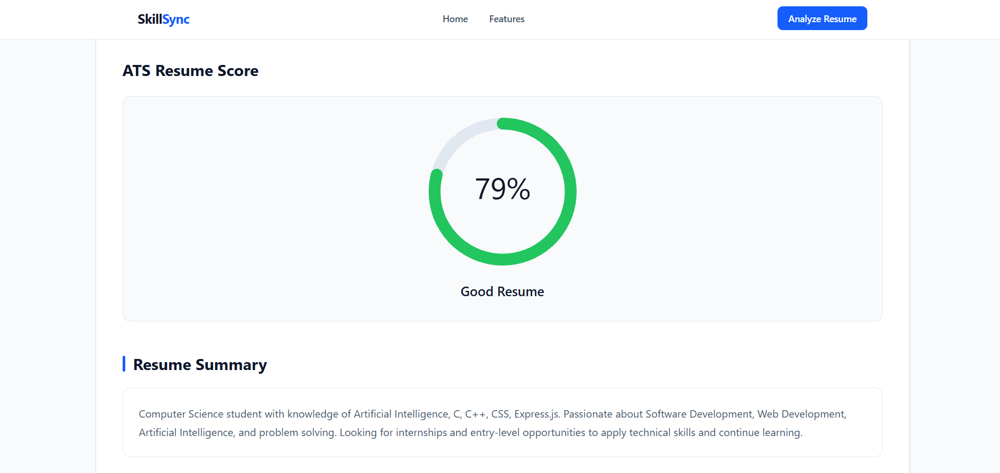
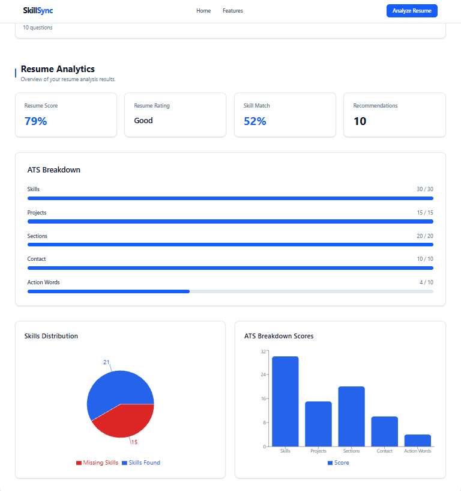

# SkillSync — Resume Analysis & Job Recommendation System

SkillSync is a full-stack web application that helps users analyze their resumes, understand their skills, identify skill gaps, improve resume quality, prepare for interviews, and discover relevant job and internship opportunities.

The application provides a structured resume analysis dashboard with ATS-oriented scoring, skill analysis, learning recommendations, interview questions, job recommendations, analytics, saved jobs, and downloadable PDF reports.

---

## Features

### Resume Analysis

- PDF, DOC, and DOCX resume upload
- Resume text extraction
- ATS-oriented resume score
- Resume rating
- Resume summary
- Extracted skills
- Required/missing skills
- Skill match percentage

### Resume Improvement

- Resume improvement suggestions
- Skill gap analysis
- Learning/course recommendations
- Personalized interview questions based on identified skills

### Job & Internship Recommendations

- Recommended jobs and internships
- Search by job title or company
- Filter jobs and internships
- Match opportunities with resume skills
- Save jobs
- Remove saved jobs

### Resume Analytics

The analytics dashboard provides:

- Resume score
- Resume rating
- Skill match percentage
- Number of recommendations
- ATS component breakdown
- Skills distribution
- ATS breakdown chart

### PDF Report

Users can download a structured resume analysis report containing:

- Resume score
- ATS rating
- Skill match percentage
- Extracted skills
- Required skills
- Resume suggestions
- Recommended jobs
- SkillSync watermark

---

## Application Workflow

```text
User
  |
  v
Landing Page
  |
  v
Resume Upload
  |
  v
FastAPI Backend
  |
  +-------------------------+
  |                         |
  v                         v
Resume Text Extraction   Skill Extraction
  |                         |
  +------------+------------+
               |
               v
        Resume Analysis
               |
       +-------+-------+
       |       |       |
       v       v       v
      ATS   Skill Gap  Suggestions
    Analysis Analysis
       |       |       |
       +-------+-------+
               |
               v
     Courses & Interview
          Questions
               |
               v
      Job / Internship
       Recommendations
               |
               v
      Analysis Dashboard
         |
   +-----+------+------+
   |            |      |
   v            v      v
Analytics    Saved   PDF Report
             Jobs
```

---

## Main Dashboard Sections

After a resume is successfully analyzed, SkillSync displays the following sections:

1. **ATS Resume Score**
2. **Resume Summary**
3. **Resume Suggestions**
4. **Required Skills**
5. **Extracted Skills**
6. **Recommended Courses**
7. **Skill Gap Analysis**
8. **Recommended Jobs & Internships**
9. **Interview Questions**
10. **Resume Analytics**
11. **Saved Jobs**
12. **Downloadable PDF Report**

---

## Tech Stack

### Frontend

- React
- JavaScript
- Vite
- Tailwind CSS
- Axios
- Lucide React
- Framer Motion
- React Circular Progressbar
- Recharts
- React Toastify
- jsPDF
- jsPDF-AutoTable

### Backend

- Python
- FastAPI
- Uvicorn
- PyPDF2
- Requests
- Python-dotenv

### Data & Processing

- CSV-based job and internship data
- Resume text extraction
- Skill extraction
- Text matching
- Similarity-based recommendation logic
- ATS-oriented resume analysis

---

## Project Structure

```text
SkillSync/
│
├── backend/
│   ├── app/
│   │   ├── data/
│   │   ├── routes/
│   │   ├── services/
│   │   ├── uploads/
│   │   └── ...
│   │
│   ├── requirements.txt
│   └── run.py
│
├── frontend/
│   ├── src/
│   │   ├── assets/
│   │   ├── components/
│   │   ├── sections/
│   │   ├── services/
│   │   └── ...
│   │
│   ├── package.json
│   └── ...
│
└── README.md
```

---

# Installation & Setup

## 1. Clone the Repository

```bash
git clone https://github.com/Umar95888/SkillSync-AI-Resume-Analyzer.git
cd SkillSync-AI-Resume-Analyzer
```

---

## 2. Backend Setup

Navigate to the backend directory:

```bash
cd backend
```

Create a Python virtual environment:

```bash
python -m venv venv
```

### Windows

Activate the virtual environment:

```bash
venv\Scripts\activate
```

Install the required dependencies:

```bash
pip install -r requirements.txt
```

If the project uses external API credentials, create a `.env` file inside the backend directory.

Example:

```env
ADZUNA_APP_ID=your_adzuna_app_id
ADZUNA_APP_KEY=your_adzuna_app_key
```

Run the backend:

```bash
python run.py
```

The backend normally runs locally at:

```text
http://127.0.0.1:8000
```

---

## 3. Frontend Setup

Open a new terminal and navigate to the frontend:

```bash
cd frontend
```

Install dependencies:

```bash
npm install
```

Start the development server:

```bash
npm run dev
```

Open the local URL displayed by Vite in your browser.

---

# Environment Variables

API credentials and other sensitive configuration values should not be committed to GitHub.

Keep environment files excluded through `.gitignore`.

Example:

```text
.env
.env.*
```

If an external API is configured, add its credentials to your local environment file.

Example:

```env
ADZUNA_APP_ID=your_app_id
ADZUNA_APP_KEY=your_app_key
```

---

# How SkillSync Works

### Step 1 — Resume Upload

The user uploads a resume in PDF, DOC, or DOCX format.

The application validates:

- File type
- File size

The current frontend allows files up to **5 MB**.

### Step 2 — Resume Processing

The frontend sends the uploaded resume to the FastAPI backend.

The backend extracts readable text from the document.

### Step 3 — Skill Extraction

The extracted resume text is processed to identify relevant technical skills.

### Step 4 — ATS-Oriented Analysis

SkillSync calculates an application-specific resume score using factors implemented in the project.

The dashboard displays the score and corresponding rating.

### Step 5 — Skill Gap Analysis

The identified resume skills are compared with required skills.

The user can see:

- Skills already identified
- Skills that may need to be developed
- Overall skill match percentage

### Step 6 — Resume Suggestions

The application provides suggestions related to improving the resume based on the analysis results.

### Step 7 — Learning Recommendations

Courses and learning resources are displayed for relevant missing skills.

### Step 8 — Interview Preparation

Interview questions are grouped according to the skills identified from the resume.

Users can expand a skill and copy its questions for practice.

### Step 9 — Job Recommendations

The application displays relevant job and internship opportunities.

Users can:

- Search opportunities
- Filter jobs
- Filter internships
- Save jobs
- Remove saved jobs

### Step 10 — Analytics

The analytics section provides a visual overview of the resume analysis.

### Step 11 — PDF Report

Users can download a structured PDF report containing important analysis results and job recommendations.

---

# ATS-Oriented Resume Analysis

The resume score displayed by SkillSync is an **application-specific ATS-oriented estimate**.

It is not an official score provided by a particular company's Applicant Tracking System (ATS).

The current analysis considers factors implemented in the project such as:

- Skills
- Projects
- Resume sections
- Contact information
- Action words

The dashboard also displays the individual component scores used in the analysis.

---

# Skill Gap Analysis

SkillSync compares the skills identified from the uploaded resume with the required skills available in the application's recommendation data.

The Skill Gap Analysis section provides:

### Skills You Already Have

Skills identified from the uploaded resume.

### Skills To Learn

Skills that are present in the required skill set but were not identified in the resume.

### Skill Match

A percentage-based overview of the match between the identified resume skills and the required skills.

---

# Recommended Courses

SkillSync provides learning resources for relevant missing skills.

Each recommendation can contain:

- Skill name
- Course title
- Course provider
- Course link

Users can open a course directly from the application using the **View Course** button.

---

# Recommended Jobs & Internships

The job recommendation section displays opportunities matched with the information extracted from the resume.

Users can search by:

```text
Job Title
Company
```

Available filters include:

```text
All
Jobs
Internships
```

Users can also save relevant opportunities for later reference.

---

# Interview Questions

Interview questions are organized by skill.

For each skill, users can:

- Expand the skill section
- View the available questions
- See the number of questions
- Copy questions to the clipboard

This allows users to practice questions related to the skills identified from their resume.

---

# Resume Analytics

The analytics dashboard provides a visual summary of the analysis results.

It includes:

### Resume Score

The overall resume score generated by the application's ATS-oriented analysis.

### Resume Rating

The rating associated with the resume score.

### Skill Match

The percentage-based skill match calculated by the application.

### Recommendations

The number of available job recommendations.

### ATS Breakdown

Individual analysis components are displayed with their corresponding scores.

### Skills Distribution

A visual representation of identified and missing skills.

### ATS Breakdown Scores

A chart displaying the individual ATS analysis component scores.

---

# Saved Jobs

Users can save recommended jobs for later review.

Saved jobs are stored in the browser using:

```text
localStorage
```

Users can:

- Save a job
- View saved jobs
- Remove a saved job

Saved jobs are browser-specific and are not synchronized across different devices.

---

# PDF Resume Analysis Report

SkillSync generates a downloadable PDF report using the analysis results.

The report can contain:

- Resume overview
- ATS resume score
- ATS rating
- Skill match percentage
- Skills found
- Required skills
- Resume summary
- Resume suggestions
- Recommended jobs
- SkillSync watermark

The generated report is named:

```text
SkillSync_Report.pdf
```

---

# User Interface

The current interface follows a clean professional design with:

- White cards
- Slate-based typography
- Blue primary actions
- Subtle borders
- Responsive layouts
- Minimal animations
- Lucide icons
- Structured dashboard sections

The application includes:

- Landing page
- Resume upload interface
- Resume analysis dashboard
- Job search and filtering
- Analytics
- Saved jobs
- PDF report generation

---

# Screenshots

> Add screenshots from the **current version** of SkillSync to the `screenshots` folder.

Recommended screenshot structure:

```text
screenshots/
├── landing-page.png
├── resume-upload.png
├── ats-score.png
├── skill-gap.png
├── job-recommendations.png
├── analytics.png
├── saved-jobs.png
└── pdf-report.png
```

### Landing Page


### Resume Upload


### ATS Resume Score



### Resume Summary


### Resume Suggestions


### Skill Gap Analysis


### Job Recommendations


### Interview Questions


### Resume Analytics



### Saved Jobs


### PDF Report


---

# Limitations

- The ATS score is an application-specific estimate and should not be treated as an official score from a company's ATS.
- Resume parsing may be less accurate for complex, scanned, or image-heavy documents.
- Recommendation quality depends on the available resume and job data.
- Job availability depends on the configured data source.
- Results can vary depending on the content and structure of the uploaded resume.
- Saved jobs are stored locally in the browser.
- External API availability can affect live job results.

---

# Future Enhancements

Possible future improvements include:

- User authentication
- User profiles
- Resume history
- Database integration
- Resume comparison
- Resume rewriting assistance
- Personalized learning paths
- Job alerts and notifications
- Additional live job sources
- Advanced analytics
- Improved resume parsing
- More comprehensive job matching

---

# Team

## SkillSync

**Project:** SkillSync — Resume Analysis & Job Recommendation System

# License

This project was developed for academic and educational purposes.

---

<p align="center">
  Built by the SkillSync Team
</p>
